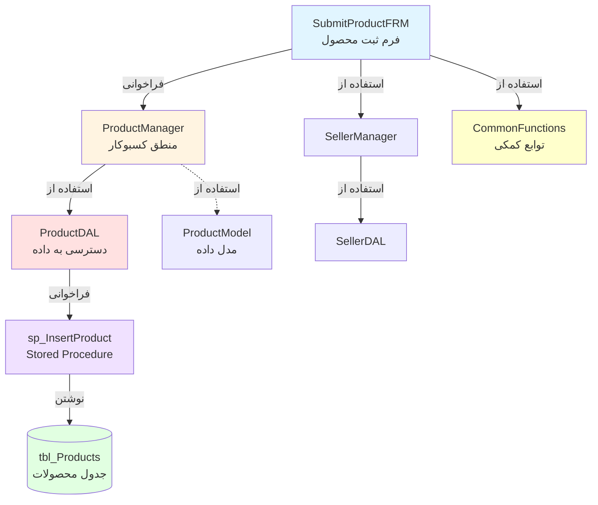

# 📋 Documentation Agent - دستورالعملهای عملیاتی

> **⚠️ مهم: این دستورالعمل را قبل از هر فعالیت مستندسازی مطالعه کنید**

---

## 🎯 هدف اصلی
ایجاد و نگهداری مستندات جامع، استاندارد و قابل استناد برای **پروژه حسابداری رستوران (MainProject)**

---

## 📊 ساختار پروژه

### فازهای پروژه
```
📌 فاز 1 (فعلی - 90% تکمیل): مدیریت انبار و فروش
   ├── ثبت و مدیریت محصولات
   ├── مدیریت فروشندگان
   ├── ثبت فاکتورها
   ├── مدیریت انبار
   └── ثبت فروش روزانه
   ⚠️ نیاز به اصلاحات جزئی در کد و UI

📌 فاز 2 (در حال برنامهریزی): حسابداری
   └── در آینده توسعه داده خواهد شد

📌 فاز 3 (برنامهریزی شده): تحلیل و گزارشگیری
   └── در آینده توسعه داده خواهد شد
```

### معماری لایهای (Layered Architecture)
```
┌─────────────────────────────────────────┐
│  1. Presentation Layer (Forms)          │  Windows Forms UI
├─────────────────────────────────────────┤
│  2. Business Logic Layer (Managers)     │  Business Rules & Validation
├─────────────────────────────────────────┤
│  3. Data Access Layer (DAL)             │  Database Communication
├─────────────────────────────────────────┤
│  4. Entity Layer (Models)               │  Data Transfer Objects
├─────────────────────────────────────────┤
│  5. Helper Layer (Utilities)            │  Common Functions
├─────────────────────────────────────────┤
│  6. Database Layer                      │  SQL Server (SP, Tables, Views)
└─────────────────────────────────────────┘
```

**جریان داده استاندارد:**
```
Form → Manager → DAL → Stored Procedure → Database
         ↓
      Entities (Models) برای انتقال داده
         ↓
      Helpers برای عملیات عمومی
```

---

## 📁 ساختار مستندات

### ساختار پوشهها و فایلها
```
Documentation/
│
├── 00-README.md                          # فهرست کلی و راهنما
│
├── 01-Introduction.md                    # فصل 1: معرفی و اهداف
│
├── 02-Architecture-Overview.md          # فصل 2: نمای کلی معماری
│   └── 02-Architecture-Overview/
│       ├── 2.1-Forms-Layer.md           # لیست و توضیح کلی فرمها
│       ├── 2.2-Business-Layer.md        # لیست و توضیح کلی Manager ها
│       ├── 2.3-DataAccess-Layer.md      # لیست و توضیح کلی DAL ها
│       ├── 2.4-Entity-Layer.md          # لیست و توضیح کلی Model ها
│       ├── 2.5-Database-Layer.md        # لیست SP و Tables
│       └── 2.6-Helper-Layer.md          # لیست توابع کمکی
│
├── 03-Forms-Details.md                   # فصل 3: جزئیات هر فرم
├── 04-Business-Details.md                # فصل 4: جزئیات هر Manager
├── 05-DataAccess-Details.md              # فصل 5: جزئیات هر DAL
├── 06-Entity-Details.md                  # فصل 6: جزئیات هر Model
├── 07-Database-Details.md                # فصل 7: جزئیات SP و Tables
├── 08-Helper-Details.md                  # فصل 8: جزئیات توابع کمکی
│
├── 09-Cross-References.md                # نقشه ارتباطات (با نمودار)
│
└── 10-Common-Components.md               # اجزای عمومی و مشترک
```

---

## 📝 قواعد مستندسازی

### ✅ قاعده 1: فرمت استاندارد هر المان

برای **هر کلاس، متد، فرم، Stored Procedure، یا جدول** از این قالب استفاده کن:

```markdown
## [نام المان]

### 📌 شناسایی
- **نوع**: [Form/Manager/DAL/Entity/Procedure/Table/Helper]
- **لایه**: [Presentation/Business/DataAccess/Entity/Database/Helper]
- **مسیر فایل**: `[مسیر کامل]`
- **نام فنی**: `[نام دقیق با namespace]`
- **نام فارسی**: [نام کاربردی فارسی]
- **وضعیت**: [Completed ✅ / In Progress 🔄 / Planned 📋]
- **فاز**: [1/2/3]

### 🎯 هدف و کاربرد
[توضیح کامل و واضح درباره هدف این المان و کاربرد آن در سیستم]

[برای انسان: توضیح ساده و کاربردی]
[برای AI: توضیح تکنیکال و دقیق]

### 🔗 وابستگیها (Dependencies)

#### ⬇️ ورودی (این المان استفاده میکند از):
| المان | نوع | دلیل استفاده | نحوه ارتباط |
|-------|-----|---------------|-------------|
| `ClassName.MethodName` | Manager/DAL | توضیح چرا | مستقیم/غیرمستقیم |
| `TableName` | Table | توضیح چرا | خواندن/نوشتن |

#### ⬆️ خروجی (این المان استفاده میشود توسط):
| المان | نوع | دلیل استفاده | نحوه فراخوانی |
|-------|-----|---------------|--------------|
| `CallerClass.Method` | Form/Manager | توضیح چرا | Event/Method Call |

### 📊 جریان داده (Data Flow)
```
[مبدأ/Input] 
    ↓
[Validation/پردازش 1]
    ↓
[Business Logic/پردازش 2]
    ↓
[Database Operation/پردازش 3]
    ↓
[Result/Output]
```

### ⚙️ پارامترها و امضا

**برای متدها:**
```csharp
[access modifier] [return type] MethodName([parameters])
```

| پارامتر | نوع داده | ورودی/خروجی | الزامی؟ | توضیحات |
|---------|----------|-------------|---------|----------|
| `param1` | `string` | IN | ✅ بله | توضیح کامل |
| `param2` | `out List<Model>` | OUT | ✅ بله | توضیح کامل |
| `message` | `out string` | OUT | ✅ بله | پیام خطا یا موفقیت |

**مقدار بازگشتی:**
- `bool`: true = موفقیت، false = خطا
- یا توضیح مقدار بازگشتی

### 🧪 نمونه استفاده
```csharp
// مثال عملی و کاربردی
var manager = new ProductManager();
if (manager.GetAllProducts(out var products, out string message))
{
    // موفق
}
else
{
    MessageBox.Show(message);
}
```

### ⚠️ نکات مهم و محدودیتها
- ✅ نکته مثبت 1
- ⚠️ محدودیت 1
- 🐛 مشکل شناخته شده 1 (اگر وجود دارد)
- 🔧 نیاز به بهبود 1 (اگر وجود دارد)

### 📅 تاریخچه تغییرات
| تاریخ | نوع تغییر | توضیحات | توسط |
|-------|----------|---------|------|
| 2025-12-17 | ایجاد اولیه | نسخه اول | Copilot |
| YYYY-MM-DD | بروزرسانی | ... | ... |

### 🤖 Metadata (برای AI)
```json
{
  "element_id": "unique_identifier",
  "element_type": "Form|Manager|DAL|Entity|Procedure|Table|Helper",
  "layer": "Presentation|Business|DataAccess|Entity|Database|Helper",
  "phase": 1,
  "status": "completed|in_progress|planned",
  "dependencies": {
    "uses": ["Class1.Method1", "Table1"],
    "used_by": ["Class2.Method2", "Form1"]
  },
  "database_objects": ["sp_GetProducts", "tbl_Products"],
  "common_component": true|false,
  "last_updated": "2025-12-17"
}
```
```

---

### ✅ قاعده 2: نقشه ارتباطات (Cross-Reference)

در فایل `09-Cross-References.md` برای هر ماژول یک نمودار Mermaid بساز:

```markdown
## [نام ماژول - مثلاً: مدیریت محصولات]

### نمودار ارتباطات


### جدول ارتباطات
| لایه | المان | ارتباط با | نوع ارتباط |
|------|--------|-----------|------------|
| Presentation | SubmitProductFRM | ProductManager | متد فراخوانی |
| Business | ProductManager | ProductDAL | متد فراخوانی |
| DataAccess | ProductDAL | sp_InsertProduct | اجرای SP |
```
```

---

### ✅ قاعده 3: اجزای عمومی (Common Components)

در فایل `10-Common-Components.md` تمام موارد زیر را مستند کن:

#### الف) کلاسهای عمومی
- `CommonFunctions`: تمام متدهای static
- `LoginInfo`: Singleton برای اطلاعات کاربر
- `Config`: تنظیمات برنامه

#### ب) توابع کمکی پرکاربرد
- Validation methods
- Format converters (فارسی به انگلیسی، جداساز هزارگان)
- Scale functions

#### پ) Stored Procedures مشترک
- SP های که از چند جا صدا زده میشوند

#### ت) جداول مشترک
- جداولی که relation با چند جدول دارند

**فرمت:**
```markdown
## [نام کامپوننت]

### 📊 آمار استفاده
- **تعداد فراخوانی**: [تعداد]
- **استفاده توسط**: [لیست کلاسها/فرمها]

### [ادامه فرمت استاندارد قاعده 1]
```

---

### ✅ قاعده 4: بهروزرسانی مداوم

**هر بار که کد تغییر میکند، این مراحل را دنبال کن:**

#### گام 1: شناسایی تغییر
- [ ] کدام فایل تغییر کرد؟
- [ ] کدام لایه؟
- [ ] آیا المان جدیدی اضافه شد؟
- [ ] آیا رابطه جدیدی ایجاد شد؟

#### گام 2: بروزرسانی فایل مربوطه
- [ ] فایل جزئیات آن لایه (فصل 3-8)
- [ ] فایل نمای کلی آن لایه (فصل 2)
- [ ] اگر المان عمومی است: فصل 10

#### گام 3: بروزرسانی ارتباطات
- [ ] اگر رابطه جدید: فصل 9 (Cross-References)
- [ ] نمودار Mermaid را آپدیت کن
- [ ] جدول ارتباطات را آپدیت کن

#### گام 4: ثبت تاریخچه
- [ ] تاریخ و نوع تغییر را در جدول "تاریخچه تغییرات" بنویس
- [ ] Metadata را آپدیت کن

---

### ✅ قاعده 5: خوانایی دوگانه (Human + AI)

#### برای انسان 👤:
- ✅ استفاده از **فارسی** برای توضیحات کاربردی
- ✅ استفاده از **emoji** و **رنگ** در نمودارها
- ✅ **جداول** برای مقایسه
- ✅ **مثالهای کاربردی** با کد واقعی
- ✅ **تصاویر** و **نمودار** برای درک بهتر

#### برای AI 🤖:
- ✅ ساختار **Markdown استاندارد**
- ✅ **تگگذاری دقیق** با کلمات کلیدی
- ✅ **روابط صریح** بین المانها
- ✅ **Metadata در فرمت JSON**
- ✅ **نامگذاری یکسان** (consistent naming)
- ✅ استفاده از **backticks** برای نامهای فنی

---

## 🎯 گردش کار (Workflow)

### زمان شروع هر وظیفه مستندسازی:

```
1️⃣ خواندن این دستورالعمل 📋
     ↓
2️⃣ خواندن فایلهای فصل 1 و 2 (درک کلی پروژه) 📖
     ↓
3️⃣ تحلیل کد مربوطه 🔍
     ↓
4️⃣ شناسایی وابستگیها و ارتباطات 🔗
     ↓
5️⃣ نوشتن/بروزرسانی مستندات با فرمت استاندارد ✍️
     ↓
6️⃣ بروزرسانی نقشه ارتباطات (اگر لازم است) 🗺️
     ↓
7️⃣ بررسی نهایی و کنترل کیفیت ✅
     ↓
8️⃣ ثبت تاریخچه تغییرات 📅
```

---

## ⚠️ نکات مهم و محدودیتها

### ❌ ممنوعیتها:
- ❌ تغییر ساختار فایلها بدون هماهنگی
- ❌ حذف Metadata در انتهای هر بخش
- ❌ نوشتن توضیحات مبهم یا ناقص
- ❌ استفاده از نامهای اختصاری بدون توضیح

### ✅ الزامات:
- ✅ همیشه از فرمت استاندارد استفاده کن
- ✅ همیشه Metadata را آپدیت کن
- ✅ همیشه تاریخچه تغییرات را ثبت کن
- ✅ همیشه نمودارها را همگام نگه دار

---

## 🚀 شروع کار

قبل از هر وظیفه این سوالات را از خودت بپرس:

1. ✅ آیا دستورالعمل را خواندم؟
2. ✅ آیا فصل 1 و 2 را خواندم؟
3. ✅ آیا کد مربوطه را تحلیل کردم؟
4. ✅ آیا وابستگیها را شناسایی کردم؟
5. ✅ آیا از فرمت استاندارد استفاده میکنم؟

---

## 📞 تماس و همکاری

- **صاحب پروژه**: lootybamaram202000
- **مخزن**: https://github.com/lootybamaram202000/MainProject
- **آخرین بروزرسانی**: 2025-12-17

---

**🎯 یادآوری: این دستورالعمل یک سند زنده است و در صورت نیاز بروزرسانی میشود.**
