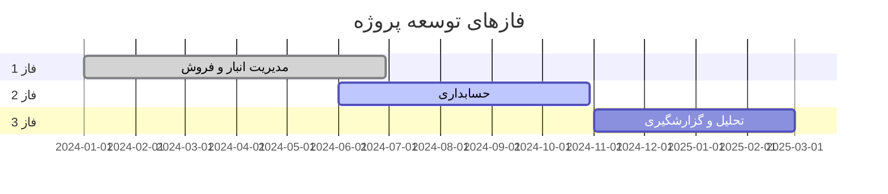
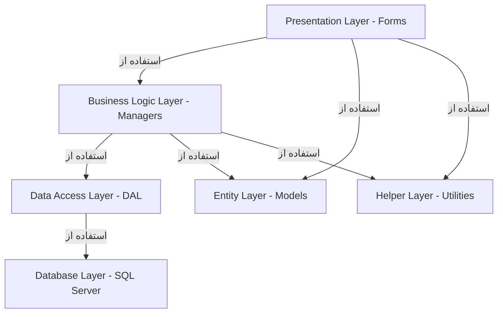

# فصل 1: معرفی برنامه

## 📋 فهرست مطالب
- [شرح کلی پروژه](#شرح-کلی-پروژه)
- [اهداف و چشم‌انداز](#اهداف-و-چشمانداز)
- [دامنه کاری](#دامنه-کاری)
- [فازهای توسعه](#فازهای-توسعه)
- [فناوری‌های استفاده شده](#فناوریهای-استفاده-شده)
- [ساختار کلی سیستم](#ساختار-کلی-سیستم)

---

## شرح کلی پروژه

### 🎯 نام پروژه
**سیستم حسابداری و مدیریت رستوران (Restaurant Management & Accounting System)**

### 📝 توضیحات
این پروژه یک سیستم جامع برای مدیریت عملیات روزمره رستوران است که شامل مدیریت انبار، فروش، حسابداری و گزارشگیری می‌باشد. سیستم با معماری لایه‌ای طراحی شده و قابلیت توسعه و نگهداری بالایی دارد.

### 👥 کاربران هدف
- **مدیر رستوران**: دسترسی کامل به همه بخش‌ها و گزارشات
- **انباردار**: مدیریت موجودی و ثبت ورود/خروج کالا
- **صندوقدار**: ثبت فروش و صدور فاکتور
- **حسابدار**: مدیریت حساب‌های مالی و گزارش‌های حسابداری
- **کارمند فروش**: ثبت سفارشات و فروش

---

## اهداف و چشم‌انداز

### 🎯 اهداف اصلی

#### 1. مدیریت کارآمد انبار
- ثبت و پیگیری موجودی کالاها
- مدیریت ورود و خروج کالا
- هشدار موجودی کمتر از حد مجاز
- مدیریت تاریخ انقضا

#### 2. فرآیند فروش ساده و سریع
- ثبت سریع سفارشات
- صدور فاکتور فروش
- مدیریت مشتریان و فروشندگان
- پیگیری وضعیت پرداخت

#### 3. حسابداری دقیق و جامع
- مدیریت حساب‌های بانکی
- ثبت هزینه‌ها و درآمدها
- تسویه حساب با فروشندگان و مشتریان
- گزارش‌های مالی استاندارد

#### 4. گزارشگیری و تحلیل
- گزارش‌های فروش روزانه/ماهانه
- تحلیل سود و زیان
- گزارش موجودی انبار
- داشبورد مدیریتی

### 🔮 چشم‌انداز
ایجاد یک سیستم یکپارچه و کامل که تمام نیازهای مدیریتی و مالی رستوران را پوشش دهد و امکان تصمیم‌گیری بهتر و سریع‌تر را فراهم کند.

---

## دامنه کاری

### ✅ موارد تحت پوشش (In Scope)

#### فاز 1: مدیریت انبار و فروش
- تعریف اقلام پایه (Basic Items)
- تعریف محصولات نهایی (Products)
- تعریف واحدها و بخش‌ها
- ثبت فاکتور فروش
- مدیریت موجودی
- تعریف منوی غذا

#### فاز 2: حسابداری
- تعریف حساب‌های بانکی
- مدیریت هزینه‌ها (Overhead)
- ثبت دریافت و پرداخت
- تسویه حساب
- اسناد حسابداری

#### فاز 3: تحلیل و گزارشگیری
- داشبورد مدیریتی
- گزارش‌های تحلیلی پیشرفته
- نمودارها و چارت‌ها
- پیش‌بینی روندها

### ❌ موارد خارج از دامنه (Out of Scope)
- مدیریت منابع انسانی (HR)
- سیستم رزرواسیون میز
- سفارش آنلاین از طریق وب
- اپلیکیشن موبایل
- پرداخت آنلاین

---

## فازهای توسعه

### 📊 وضعیت کلی پروژه



### فاز 1: مدیریت انبار و فروش ✅ (90% تکمیل)

**مدت زمان**: 6 ماه  
**وضعیت**: تقریباً کامل - نیاز به تست و اصلاحات جزئی

**ویژگی‌های پیاده‌سازی شده:**
- ✅ تعریف اقلام پایه و واحدها
- ✅ تعریف محصولات و دستور پخت
- ✅ تعریف بخش‌ها
- ✅ ثبت فاکتور فروش
- ✅ مدیریت اطلاعات فروشندگان
- ✅ تعریف منوی غذا
- ✅ ورود و خروج کالا

**موارد باقی‌مانده:**
- 🔄 گزارش موجودی پیشرفته
- 🔄 مدیریت تاریخ انقضا
- 🔄 تست کامل و رفع باگ‌های جزئی

### فاز 2: حسابداری 🚧 (40% تکمیل)

**مدت زمان**: 5 ماه  
**وضعیت**: در حال توسعه

**ویژگی‌های پیاده‌سازی شده:**
- ✅ تعریف حساب‌های بانکی (Basic)
- ✅ تعریف هزینه‌ها
- 🔄 ثبت دریافت و پرداخت (در حال توسعه)

**موارد باقی‌مانده:**
- ⏳ تسویه حساب با فروشندگان
- ⏳ اسناد حسابداری
- ⏳ گزارش‌های مالی استاندارد
- ⏳ مدیریت چک و سفته

### فاز 3: تحلیل و گزارشگیری 📅 (برنامه‌ریزی شده)

**مدت زمان**: 4 ماه  
**وضعیت**: برنامه‌ریزی شده

**ویژگی‌های برنامه‌ریزی شده:**
- ⏳ داشبورد مدیریتی با نمودارها
- ⏳ گزارش تحلیلی فروش
- ⏳ تحلیل سود و زیان
- ⏳ پیش‌بینی روندها
- ⏳ گزارشات قابل تنظیم (Customizable Reports)

---

## فناوری‌های استفاده شده

### 💻 پلتفرم و زبان برنامه‌نویسی
- **Framework**: .NET Framework 4.7.2 یا بالاتر
- **زبان**: C# 7.3
- **رابط کاربری**: Windows Forms

### 🗄️ پایگاه داده
- **DBMS**: Microsoft SQL Server 2016 یا بالاتر
- **ORM**: ADO.NET (سنتی با Stored Procedures)
- **دسترسی به داده**: SqlCommand و SqlDataAdapter

### 🏗️ الگوهای طراحی
- **معماری**: Layered Architecture (6 لایه)
- **الگوی دسترسی به داده**: Repository Pattern (سبک DAL)
- **الگوی کسب‌وکار**: Service Layer Pattern (Manager Classes)

### 📦 کتابخانه‌های شخص ثالث
- **UI Controls**: DevExpress / Telerik (اختیاری)
- **Reporting**: Crystal Reports / Microsoft Report Viewer
- **PDF Generation**: iTextSharp

---

## ساختار کلی سیستم

### 🏛️ معماری لایه‌ای



### لایه‌های سیستم

#### 1. **Presentation Layer** (فرمها)
- **مسیر**: `MainProject/Forms/`
- **نقش**: رابط کاربری و تعامل با کاربر
- **مسئولیت**: نمایش داده‌ها و دریافت ورودی

#### 2. **Business Logic Layer** (Manager Classes)
- **مسیر**: `MainProject/Core/Business/`
- **نقش**: پیاده‌سازی منطق کسب‌وکار
- **مسئولیت**: اعتبارسنجی، پردازش و هماهنگی عملیات

#### 3. **Data Access Layer** (DAL Classes)
- **مسیر**: `MainProject/DataAccess/`
- **نقش**: دسترسی به پایگاه داده
- **مسئولیت**: اجرای Query و Stored Procedure

#### 4. **Entity Layer** (Model Classes)
- **مسیر**: `MainProject/Entities/`
- **نقش**: نمایش داده‌ها
- **مسئولیت**: DTO و Model Classes

#### 5. **Database Layer** (SQL Server)
- **مسیر**: `MainProject/DatabaseScripts/`
- **نقش**: ذخیره‌سازی داده
- **مسئولیت**: جداول، Views، Stored Procedures

#### 6. **Helper Layer** (توابع کمکی)
- **مسیر**: `MainProject/Helpers/`
- **نقش**: توابع عمومی
- **مسئولیت**: توابع کمکی و Utilities

---

## 📊 آمار پروژه

### کد و فایل‌ها
- **تعداد فرمها**: ~45 فرم
- **تعداد Manager Classes**: ~12 کلاس
- **تعداد DAL Classes**: ~12 کلاس
- **تعداد Model Classes**: ~16 کلاس
- **تعداد Stored Procedures**: ~80 پروسیجر
- **تعداد جداول**: ~25 جدول

### خطوط کد (تقریبی)
- **C# Code**: ~15,000 خط
- **SQL Scripts**: ~5,000 خط
- **کل**: ~20,000 خط

---

## 🔐 امنیت و دسترسی

### سطوح دسترسی
1. **Administrator**: دسترسی کامل
2. **Manager**: مدیریت عملیاتی
3. **Accountant**: حسابداری
4. **Cashier**: صندوق و فروش
5. **Warehouse**: انبار

### ویژگی‌های امنیتی
- ✅ احراز هویت با Username/Password
- ✅ ذخیره رمز عبور به صورت Hash
- ✅ سطوح دسترسی کاربران
- 🔄 Log فعالیت‌های کاربران (در حال توسعه)
- 🔄 Audit Trail (برنامه‌ریزی شده)

---

## 📅 تاریخچه تغییرات

### نسخه 1.0 - فاز 1 (2024-06-01)
- پیاده‌سازی مدیریت انبار
- پیاده‌سازی فروش و فاکتور
- تعریف اقلام و محصولات

### نسخه 1.1 - فاز 2 (در حال توسعه)
- شروع پیاده‌سازی حسابداری
- تعریف حساب‌های بانکی
- مدیریت هزینه‌ها

---

**تاریخ ایجاد**: 2025-12-17  
**آخرین به‌روزرسانی**: 2025-12-17  
**نویسنده**: تیم توسعه MainProject

---

## Metadata (برای AI)

```json
{
  "document_type": "introduction",
  "chapter": 1,
  "project_name": "Restaurant Management System",
  "project_status": "in_development",
  "current_phase": 2,
  "total_phases": 3,
  "language": "Persian (Farsi)",
  "technical_stack": ["C#", ".NET Framework", "Windows Forms", "SQL Server"],
  "architecture": "Layered Architecture",
  "last_updated": "2025-12-17",
  "version": "1.0"
}
```
