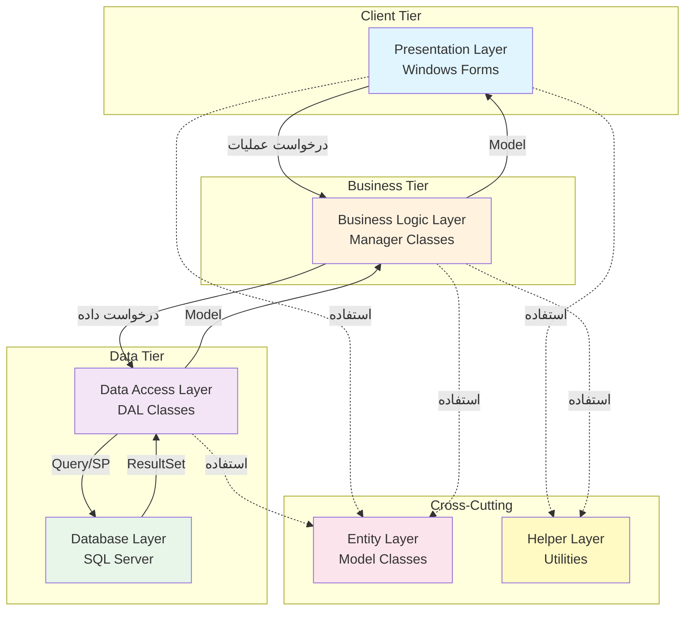
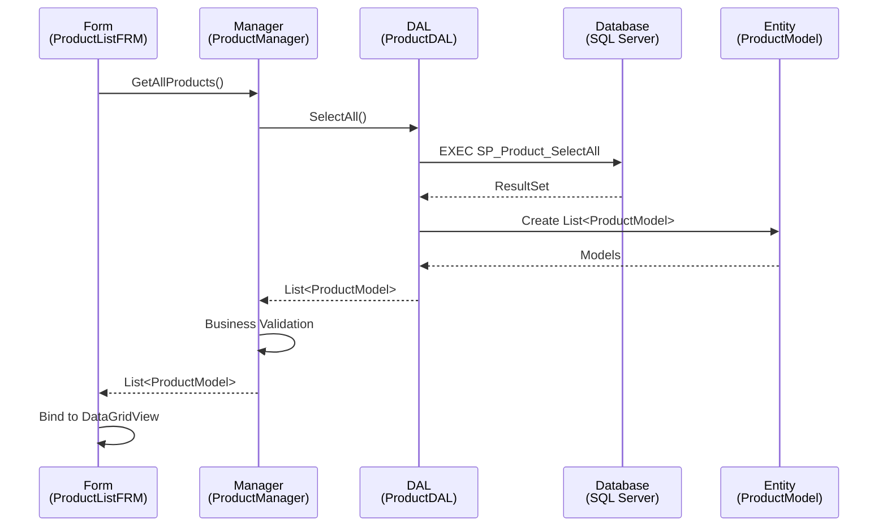
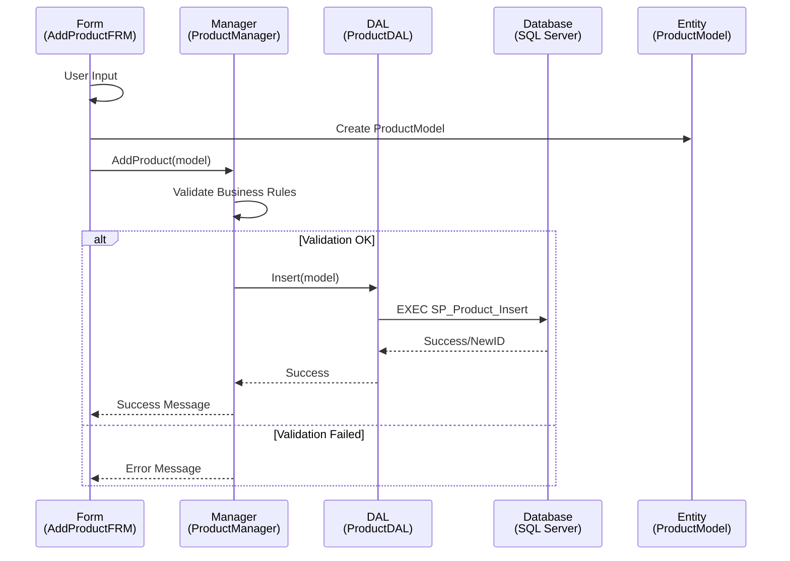
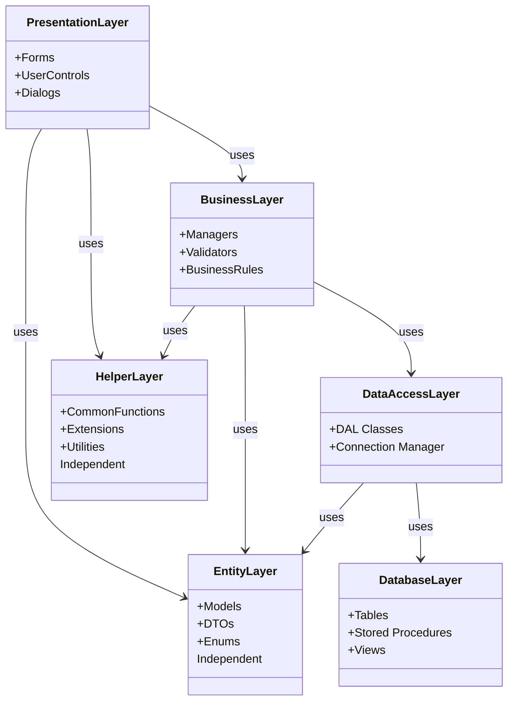

# فصل 2: نمای کلی معماری

## 📋 فهرست مطالب
- [معرفی معماری](#معرفی-معماری)
- [الگوی معماری لایه‌ای](#الگوی-معماری-لایهای)
- [لایه‌های سیستم](#لایههای-سیستم)
- [جریان داده](#جریان-داده)
- [الگوهای طراحی](#الگوهای-طراحی)
- [اصول معماری](#اصول-معماری)

---

## معرفی معماری

### 🎯 هدف معماری
این سیستم بر اساس **Layered Architecture (معماری لایه‌ای)** طراحی شده است که مزایای زیر را فراهم می‌کند:

- **جداسازی نگرانی‌ها (Separation of Concerns)**: هر لایه مسئولیت مشخصی دارد
- **قابلیت نگهداری بالا**: تغییرات در یک لایه بدون تأثیر بر سایر لایه‌ها
- **قابلیت تست**: هر لایه به صورت مستقل قابل تست است
- **مقیاس‌پذیری**: امکان توسعه و بهبود هر لایه به صورت جداگانه
- **استفاده مجدد**: اجزا قابل استفاده در بخش‌های مختلف

---

## الگوی معماری لایه‌ای

### 🏗️ ساختار 6 لایه‌ای



### توضیحات نمودار
- **خطوط پیوسته**: جریان اصلی داده
- **خطوط نقطه‌چین**: وابستگی و استفاده

---

## لایه‌های سیستم

### 1️⃣ Presentation Layer (لایه نمایش)

**📁 مسیر**: `MainProject/Forms/`

**🎯 مسئولیت‌ها:**
- نمایش داده‌ها به کاربر
- دریافت ورودی از کاربر
- اعتبارسنجی ورودی اولیه (Client-side Validation)
- مدیریت رویدادهای UI

**📊 اجزا:**
- فرمهای Windows Forms
- UserControls
- DialogBoxes
- Validation Controls

**🔗 وابستگی‌ها:**
- استفاده از Business Layer
- استفاده از Entity Layer (Models)
- استفاده از Helper Layer

**📄 جزئیات بیشتر**: [2.1-Forms-Layer.md](02-Architecture-Overview/2.1-Forms-Layer.md)

---

### 2️⃣ Business Logic Layer (لایه منطق کسب‌وکار)

**📁 مسیر**: `MainProject/Core/Business/`

**🎯 مسئولیت‌ها:**
- پیاده‌سازی قوانین کسب‌وکار
- اعتبارسنجی داده‌ها (Business Validation)
- هماهنگی بین لایه‌ها
- مدیریت تراکنش‌ها
- پردازش و تبدیل داده‌ها

**📊 اجزا:**
- Manager Classes (مثل ItemManager, ProductManager)
- Business Rules
- Validators
- Coordinators

**🔗 وابستگی‌ها:**
- استفاده از Data Access Layer
- استفاده از Entity Layer
- استفاده از Helper Layer

**📄 جزئیات بیشتر**: [2.2-Business-Layer.md](02-Architecture-Overview/2.2-Business-Layer.md)

---

### 3️⃣ Data Access Layer (لایه دسترسی به داده)

**📁 مسیر**: `MainProject/DataAccess/`

**🎯 مسئولیت‌ها:**
- اجرای Query و Stored Procedure
- تبدیل ResultSet به Model
- مدیریت Connection و Command
- مدیریت خطاهای دیتابیس

**📊 اجزا:**
- DAL Classes (مثل ItemDAL, ProductDAL)
- Database Helpers
- Connection Manager

**🔗 وابستگی‌ها:**
- استفاده از Database Layer
- استفاده از Entity Layer
- استفاده از Helper Layer

**📄 جزئیات بیشتر**: [2.3-DataAccess-Layer.md](02-Architecture-Overview/2.3-DataAccess-Layer.md)

---

### 4️⃣ Entity Layer (لایه موجودیت)

**📁 مسیر**: `MainProject/Entities/`

**🎯 مسئولیت‌ها:**
- تعریف مدل‌های داده
- DTO (Data Transfer Objects)
- ViewModels
- Domain Models

**📊 اجزا:**
- Model Classes (مثل ItemModel, ProductModel)
- DTOs
- Enums

**🔗 وابستگی‌ها:**
- بدون وابستگی (POCO Classes)
- فقط Properties و Basic Attributes

**📄 جزئیات بیشتر**: [2.4-Entity-Layer.md](02-Architecture-Overview/2.4-Entity-Layer.md)

---

### 5️⃣ Database Layer (لایه پایگاه داده)

**📁 مسیر**: `MainProject/DatabaseScripts/`

**🎯 مسئولیت‌ها:**
- ذخیره‌سازی داده‌ها
- یکپارچگی داده‌ها (Data Integrity)
- Stored Procedures
- Functions و Views

**📊 اجزا:**
- جداول (Tables)
- Stored Procedures
- Views
- Functions
- Triggers
- Indexes

**🔗 وابستگی‌ها:**
- SQL Server Database Engine
- استفاده از Foreign Keys و Constraints

**📄 جزئیات بیشتر**: [2.5-Database-Layer.md](02-Architecture-Overview/2.5-Database-Layer.md)

---

### 6️⃣ Helper Layer (لایه کمکی)

**📁 مسیر**: `MainProject/Helpers/`

**🎯 مسئولیت‌ها:**
- توابع عمومی و مشترک
- Utility Functions
- مدیریت Configuration
- Extension Methods

**📊 اجزا:**
- CommonFunctions
- LoginInfo
- Config Manager
- Extension Methods

**🔗 وابستگی‌ها:**
- بدون وابستگی به سایر لایه‌ها
- فقط استفاده از کتابخانه‌های .NET

**📄 جزئیات بیشتر**: [2.6-Helper-Layer.md](02-Architecture-Overview/2.6-Helper-Layer.md)

---

## جریان داده

### 🔄 سناریوی معمول: نمایش لیست محصولات



### 📝 مراحل:
1. **کاربر**: درخواست نمایش لیست محصولات
2. **Form**: فراخوانی متد Manager
3. **Manager**: اعمال Business Rules و فراخوانی DAL
4. **DAL**: اجرای Stored Procedure
5. **Database**: برگرداندن نتایج
6. **DAL**: تبدیل به Model
7. **Manager**: اعتبارسنجی و پردازش
8. **Form**: نمایش به کاربر

---

### 🔄 سناریوی معمول: ثبت محصول جدید



---

## الگوهای طراحی

### 🎨 الگوهای اصلی استفاده شده

#### 1. Repository Pattern
```csharp
// DAL Classes به عنوان Repository عمل می‌کنند
public class ProductDAL
{
    public List<ProductModel> SelectAll() { ... }
    public ProductModel SelectByID(int id) { ... }
    public bool Insert(ProductModel model) { ... }
    public bool Update(ProductModel model) { ... }
    public bool Delete(int id) { ... }
}
```

#### 2. Service Layer Pattern
```csharp
// Manager Classes به عنوان Service Layer
public class ProductManager
{
    private ProductDAL _dal = new ProductDAL();
    
    public List<ProductModel> GetAllProducts()
    {
        // Business Logic
        var products = _dal.SelectAll();
        // Post-processing
        return products;
    }
}
```

#### 3. DTO Pattern
```csharp
// Entity Models به عنوان DTO
public class ProductModel
{
    public int ProductID { get; set; }
    public string ProductName { get; set; }
    public decimal Price { get; set; }
}
```

#### 4. Singleton Pattern
```csharp
// برای LoginInfo
public class LoginInfo
{
    private static LoginInfo _instance;
    public static LoginInfo Instance
    {
        get { return _instance ?? (_instance = new LoginInfo()); }
    }
}
```

---

## اصول معماری

### ⚡ اصول SOLID

#### 1. Single Responsibility Principle (SRP)
- هر کلاس یک مسئولیت واحد دارد
- مثال: `ProductDAL` فقط مسئول دسترسی به داده

#### 2. Open/Closed Principle (OCP)
- کلاس‌ها برای توسعه باز و برای تغییر بسته هستند
- استفاده از Interface برای گسترش

#### 3. Liskov Substitution Principle (LSP)
- استفاده از Base Classes و Inheritance

#### 4. Interface Segregation Principle (ISP)
- Interface های کوچک و تخصصی

#### 5. Dependency Inversion Principle (DIP)
- وابستگی به Abstraction نه Concrete

### 🎯 اصول اضافی

#### Separation of Concerns
- جداسازی منطق UI از Business Logic
- جداسازی Data Access از Business Logic

#### DRY (Don't Repeat Yourself)
- استفاده از Helper Functions
- استفاده از Base Classes

#### KISS (Keep It Simple, Stupid)
- کدهای ساده و خوانا
- عدم Over-Engineering

---

## مزایا و معایب معماری

### ✅ مزایا
- **قابلیت نگهداری**: تغییرات آسان در هر لایه
- **قابلیت تست**: تست مستقل هر لایه
- **مقیاس‌پذیری**: امکان رشد در آینده
- **استفاده مجدد**: کدهای قابل استفاده مجدد
- **تیم‌ورک**: امکان کار موازی تیم

### ⚠️ معایب و محدودیت‌ها
- **پیچیدگی اولیه**: نیاز به زمان بیشتر در ابتدا
- **Overhead**: لایه‌های اضافی می‌تواند Performance را کاهش دهد
- **Over-Engineering**: احتمال پیچیده‌تر شدن بیش از حد

---

## نمودار کلی روابط



---

## 📅 تاریخچه تغییرات

### 2025-12-17
- ایجاد اولیه مستند معماری
- تعریف 6 لایه اصلی
- توضیح الگوهای طراحی

---

**تاریخ ایجاد**: 2025-12-17  
**آخرین به‌روزرسانی**: 2025-12-17  
**نویسنده**: تیم توسعه MainProject

---

## Metadata (برای AI)

```json
{
  "document_type": "architecture_overview",
  "chapter": 2,
  "architecture_pattern": "Layered Architecture",
  "layers_count": 6,
  "design_patterns": ["Repository", "Service Layer", "DTO", "Singleton"],
  "language": "Persian (Farsi)",
  "last_updated": "2025-12-17",
  "version": "1.0"
}
```
