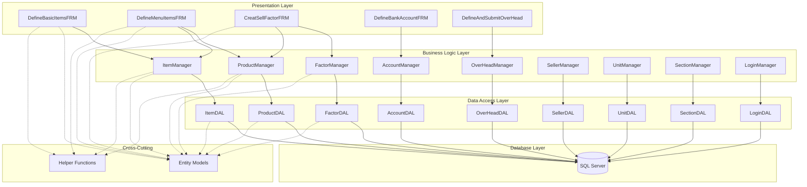
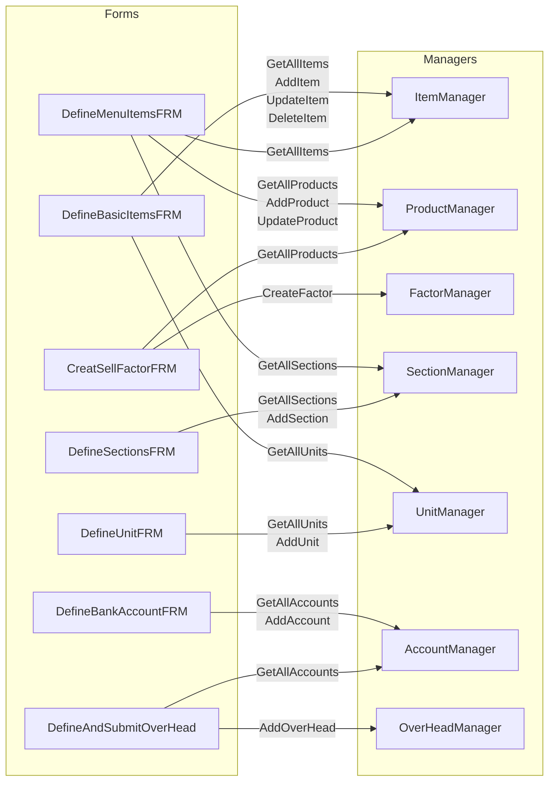
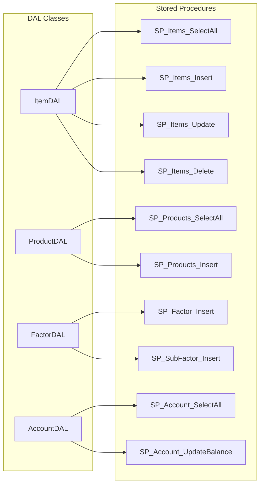
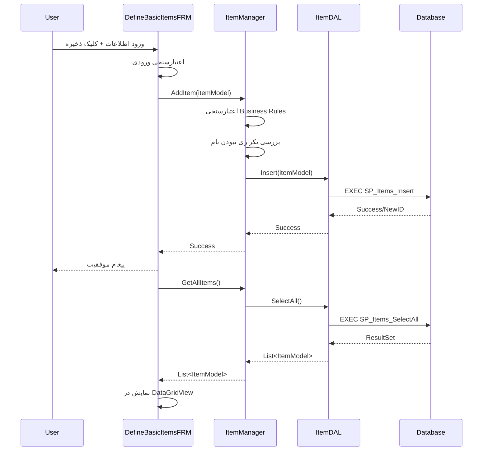
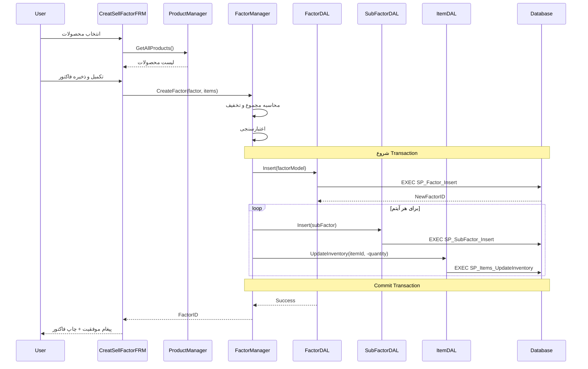
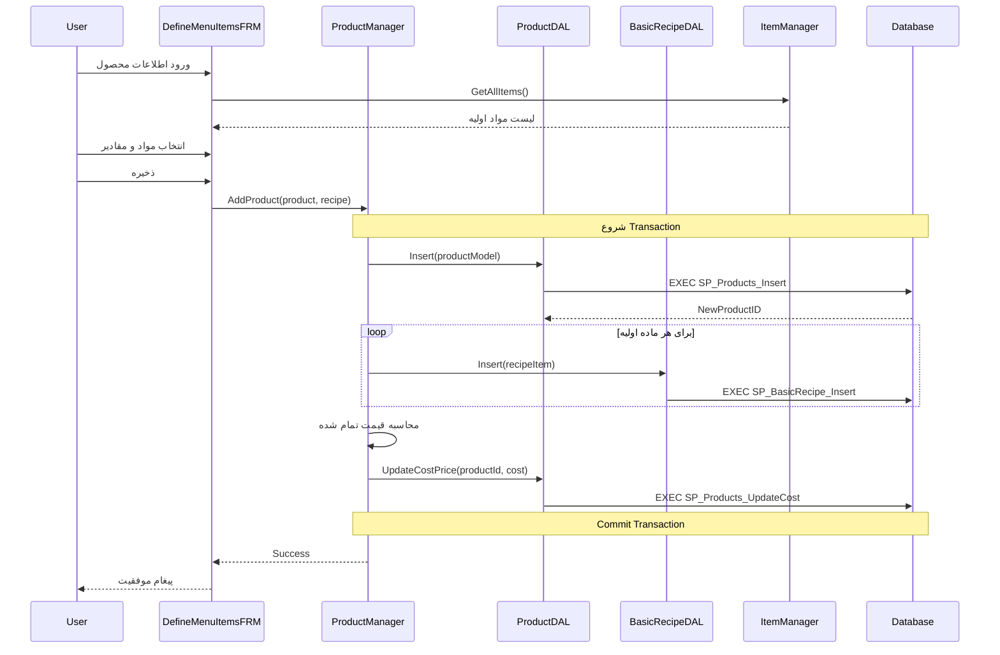

# فصل 9: نقشه ارتباطات (Cross-References Map)

## 📋 فهرست مطالب
- [معرفی](#معرفی)
- [نمودار کلی ارتباطات](#نمودار-کلی-ارتباطات)
- [ارتباطات Forms به Business](#ارتباطات-forms-به-business)
- [ارتباطات Business به DAL](#ارتباطات-business-به-dal)
- [ارتباطات DAL به Database](#ارتباطات-dal-به-database)
- [جریان داده End-to-End](#جریان-داده-end-to-end)

---

## معرفی

این بخش نقشه کامل ارتباطات و وابستگی‌های بین اجزای مختلف سیستم را نمایش می‌دهد.

---

## نمودار کلی ارتباطات

### معماری کلی سیستم



---

## ارتباطات Forms به Business

### نمودار ارتباطات فرمها



---

## ارتباطات Business به DAL

### جدول وابستگی‌ها

| Manager Class | استفاده از DAL | متدهای استفاده شده |
|---------------|----------------|-------------------|
| ItemManager | ItemDAL | SelectAll, SelectByID, Insert, Update, Delete |
| ItemManager | UnitDAL | SelectAll (برای اعتبارسنجی) |
| ProductManager | ProductDAL | SelectAll, SelectByID, Insert, Update |
| ProductManager | ItemDAL | SelectAll (برای دستور پخت) |
| ProductManager | BasicRecipeDAL | Insert, Update, Delete |
| FactorManager | FactorDAL | Insert, SelectAll |
| FactorManager | SubFactorDAL | Insert |
| FactorManager | ItemDAL | UpdateInventory |
| AccountManager | AccountDAL | SelectAll, Insert, Update |
| OverHeadManager | OverHeadDAL | Insert, SelectAll |
| OverHeadManager | AccountDAL | UpdateBalance |

---

## ارتباطات DAL به Database

### نمودار Stored Procedures



### جدول کامل SP ها

| DAL Class | Stored Procedure | عملیات |
|-----------|------------------|--------|
| ItemDAL | SP_Items_SelectAll | دریافت لیست |
| ItemDAL | SP_Items_SelectByID | دریافت یک رکورد |
| ItemDAL | SP_Items_Insert | افزودن |
| ItemDAL | SP_Items_Update | ویرایش |
| ItemDAL | SP_Items_Delete | حذف |
| ItemDAL | SP_Items_UpdateInventory | به‌روزرسانی موجودی |
| ProductDAL | SP_Products_SelectAll | دریافت لیست |
| ProductDAL | SP_Products_Insert | افزودن |
| ProductDAL | SP_Products_Update | ویرایش |
| ProductDAL | SP_BasicRecipe_Insert | افزودن دستور پخت |
| FactorDAL | SP_Factor_Insert | ثبت فاکتور |
| FactorDAL | SP_Factor_SelectAll | دریافت فاکتورها |
| FactorDAL | SP_SubFactor_Insert | ثبت آیتم فاکتور |

---

## جریان داده End-to-End

### سناریو 1: تعریف قلم جدید



---

### سناریو 2: ثبت فاکتور فروش



---

### سناریو 3: تعریف محصول با دستور پخت



---

## ماتریس وابستگی کامل

### Forms → Managers

| Form | Managers استفاده شده |
|------|---------------------|
| DefineBasicItemsFRM | ItemManager, UnitManager |
| DefineMenuItemsFRM | ProductManager, ItemManager, SectionManager |
| CreatSellFactorFRM | FactorManager, ProductManager, SellerManager |
| DefineSectionsFRM | SectionManager |
| DefineUnitFRM | UnitManager |
| DefineBankAccountFRM | AccountManager |
| DefineAndSubmitOverHead | OverHeadManager, AccountManager |
| LoginFRM | LoginManager |

### Managers → DAL Classes

| Manager | DAL Classes استفاده شده |
|---------|----------------------|
| ItemManager | ItemDAL, UnitDAL |
| ProductManager | ProductDAL, BasicRecipeDAL, ItemDAL |
| FactorManager | FactorDAL, SubFactorDAL, ItemDAL |
| AccountManager | AccountDAL |
| OverHeadManager | OverHeadDAL, AccountDAL |
| SellerManager | SellerDAL |
| UnitManager | UnitDAL |
| SectionManager | SectionDAL |
| LoginManager | LoginDAL |

---

## نکات مهم

### قواعد وابستگی

1. **Forms** فقط به **Managers** وابسته است (نه DAL)
2. **Managers** فقط به **DAL** وابسته است (نه Database)
3. **DAL** فقط به **Database** وابسته است (نه Business Logic)
4. **Entity Models** به هیچ لایه‌ای وابسته نیست (POCO)
5. **Helpers** به هیچ لایه‌ای وابسته نیست (Utility)

### الگوی ارتباط

```
Form → Manager → DAL → Database
```

این الگو در تمام عملیات رعایت می‌شود.

---

## 📅 تاریخچه تغییرات

### 2025-12-17
- ایجاد اولیه نقشه ارتباطات
- نمودارهای Mermaid
- سناریوهای End-to-End

---

**تاریخ ایجاد**: 2025-12-17  
**آخرین به‌روزرسانی**: 2025-12-17

---

## Metadata (برای AI)

```json
{
  "document_type": "cross_references",
  "chapter": 9,
  "diagrams_count": 6,
  "scenarios_count": 3,
  "language": "Persian (Farsi)",
  "last_updated": "2025-12-17",
  "version": "1.0"
}
```
